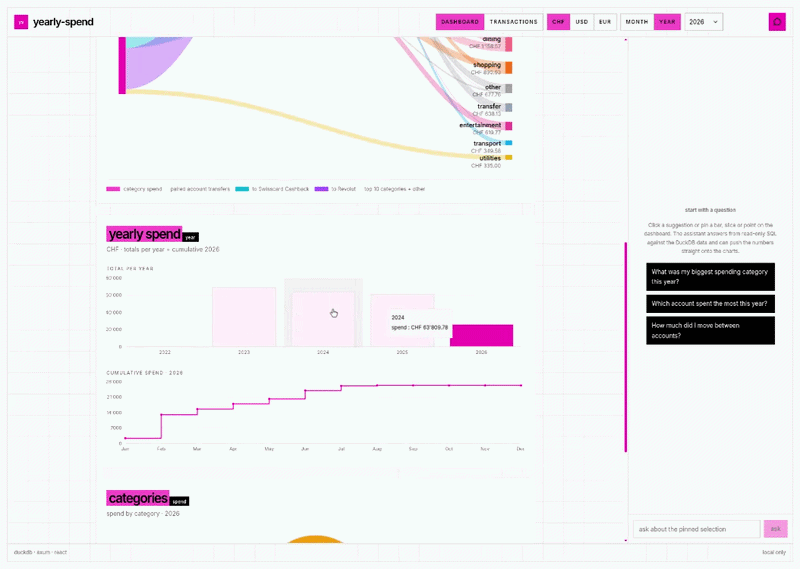
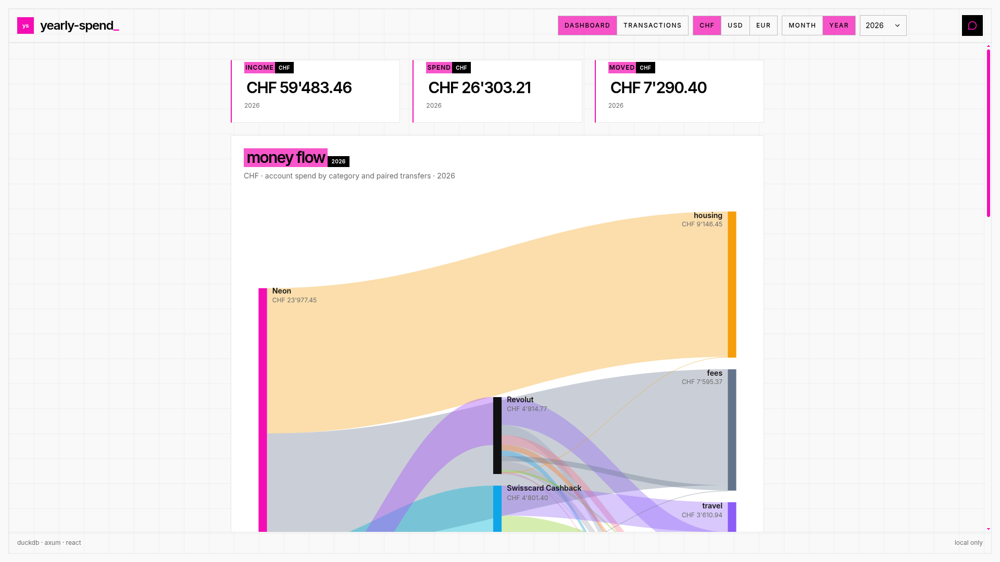
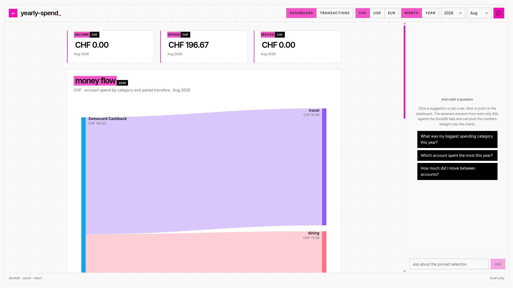
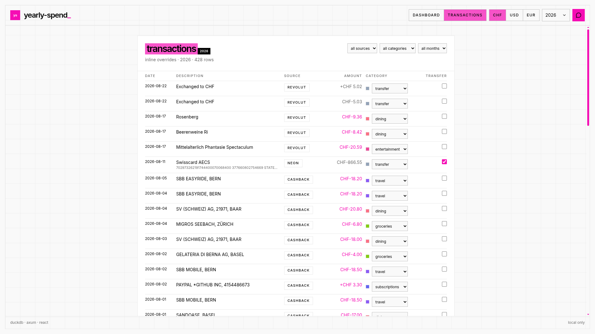
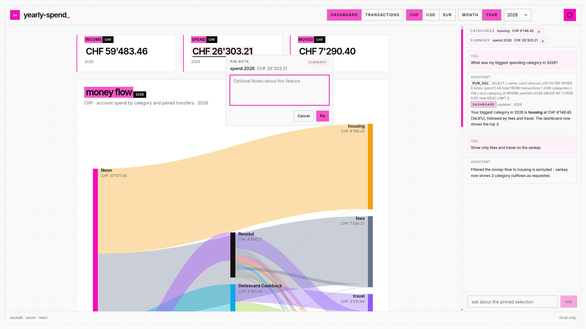
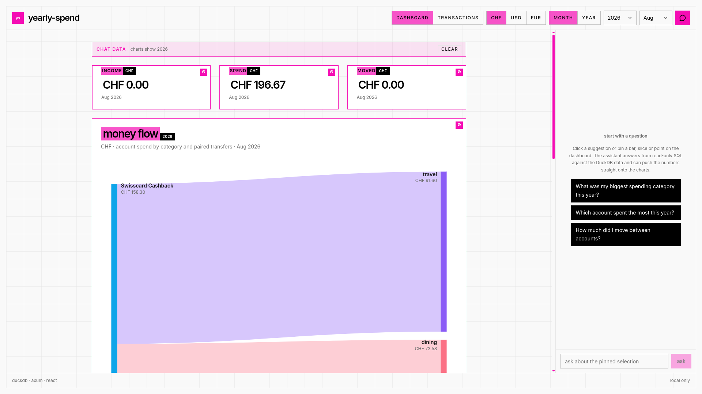

# yearly-spend

A personal finance dashboard I built to track my own spending. It ingests raw CSV exports from Neon, Revolut, and Swisscard (semicolon and comma formats), normalizes every amount to CHF using monthly FX rates from Frankfurter, and categorizes each transaction with an LLM into a fixed 18-category taxonomy. The dashboard itself is fully local and pixel-styled: year and month views, multi-currency display, a Sankey diagram of the money flow, and a chat inspector that can run read-only SQL against the DuckDB file and push the results back onto the charts.


*Demo: dashboard, AI chat, and inline transaction editing (1920x1080).*

## Screenshots

All captures are 1920x1080, full page (`images/`).

| Yearly overview | Month view |
|---|---|
|  |  |
| KPI cards, money-flow Sankey, yearly totals plus cumulative, category donut. The navbar has the year picker, currency (CHF/USD/EUR), and the month/year view toggle. | The same data scoped to one month: a monthly bar chart, a daily drill-down, and month-scoped Sankey and categories. |

| Transactions, inline overrides | AI chat and pins |
|---|---|
|  |  |
| Filterable, paginated table. Category is a taxonomy dropdown, `is_transfer` is a checkbox. `PATCH /api/transactions/{id}` flips `kind` via `kind_for_transfer` and writes through a short-lived read-write connection. All lists use a read-only connection. | Click any bar, slice, or point to pin a selection chip (chart, value, year/month, note). The inspector sends `{message, selections, history}` to `POST /api/chat`. The model replies over SSE with `run_sql` traces and `render_dashboard` overlays. |

| AI-generated data mode |
|---|---|
|  |
| When the assistant pushes data, the affected cards get a super-thin pink border (`!border-brand-pink`) and a small pink bot icon in the top-right corner. Examples: top-3 categories with the Sankey filtered to those 3 outflows, KPIs in USD, or month-scoped data. Change any navbar control (currency, year, month, view) and the overlay clears, returning to live DB data. |

## Tech stack

| Layer | Tech |
|---|---|
| Backend | Rust (edition 2024) workspace. `core` holds the schema and migrations, DuckDB access, the FX cache, the LLM client, and the `run_sql`/`render_dashboard` tool loop. `ingest` has the Neon, Revolut, and Cashback parsers, SHA-based whole-file skip plus natural-key row upserts, and 60-row LLM batch categorization. `api` is Axum on `127.0.0.1:3000`: SSE `POST /api/chat`, JSON `GET /api/meta,/summary,/series/*,/categories,/transactions`, `PATCH /api/transactions/{id}`, `GET /api/fx`, and an SPA fallback. |
| Database | DuckDB (bundled). A single file at `data/spend.duckdb` (`DB_PATH`). Migrations live in `core/src/schema.rs` alongside the 18-category taxonomy and 4 seeded accounts. |
| Frontend | Vite + React 19 + TypeScript + Tailwind 4 + shadcn/ui + Recharts, managed with pnpm. Hash routing (`#/` for the dashboard, `#/transactions` for the table), a 2px-border pixel design, and currency formatting with live Frankfurter spot rates. |
| LLM / FX | Local `llama-server` (OpenAI-compatible `/v1/chat/completions` SSE) or Gemini (`streamGenerateContent` SSE), selected via `.env`. Frankfurter supplies the monthly average and spot FX rates, cached in `fx_rates`. |
| Tooling | `just` task runner. `cargo fmt/clippy/test` with `-D warnings` and `unsafe_code = "forbid"`. `pnpm lint/format/build`. `reqwest`, `sqlparser` (DuckDB dialect plus a lexical WITH-tail guard), `tower-http`. |

## Highlights

- **Full-stack ownership.** One Rust binary serves the Vite SPA. A single `spend-core` crate is shared by the ingest CLI and the API, and the types that read DuckDB rows are the same types the API serializes to JSON.
- **The LLM is a data tool, not a narrator.** The chat model has exactly two tools. `run_sql` is SELECT-only. The query must parse through sqlparser, and a second lexical check makes sure a `WITH` clause ends in `SELECT` or `VALUES`, because sqlparser alone parses `WITH ... INSERT` as a query. It runs on a read-only connection, capped at 100 rows and 8 rounds. Ingest categorization must map every row to a valid taxonomy entry, and every call is audited in the `llm_calls` table. `render_dashboard` output is JSON-schema validated before it is overlaid on the live data for its year.
- **Conversational memory without server state.** The frontend sends the last 20 turns (`{role, content}`) with every request, and the backend replays that history before the new user message for both the local provider (OpenAI `messages`) and Gemini (`contents`). Follow-ups like "what about last year?" work with no session storage on the server.
- **Security and correctness as defaults.** `unsafe_code = "forbid"` across the workspace. API connections are read-only by default, and only `PATCH` opens a short-lived read-write connection. FX and ingest are idempotent (file SHA plus `UNIQUE(source, source_key)`), so re-running is always safe.

## Setup

### Requirements

- Rust 1.85+ (edition 2024)
- `pnpm` 9+
- `just` (optional; plain `cargo`/`pnpm` commands work directly)
- DuckDB is bundled, so no external database is needed

### Quick start

```sh
cp .env.example .env
just setup          # installs deps, builds Rust + frontend
just serve          # builds frontend, starts http://127.0.0.1:3000
# or without just:
cargo build
pnpm --dir frontend install --frozen-lockfile
pnpm --dir frontend build
cargo run -p spend-api
```

Open http://127.0.0.1:3000. The dashboard works without an LLM. It shows whatever is already in `data/spend.duckdb`, which is empty on a first checkout.

### Ingest statements

```sh
cargo run -p ingest -- ingest statements/
# or: just ingest
```

Place exports under `statements/<source>/`. The source is inferred from the nearest ancestor directory named `neon`, `revolut`, or `cashback_cards` (case-insensitive). The file SHA is checked first, so already-ingested files are skipped, and rows are upserted by natural key.

### LLM setup

One `.env` configures both ingest categorization and chat. You only need an LLM for those two features.

#### Option A: local model (default, fully offline)

The repo defaults to an OpenAI-compatible local server:

```sh
# .env
LLM_PROVIDER=local
LLM_BASE_URL=http://localhost:11434/v1
LLM_API_KEY=sk-local-token
LLM_MODEL=/path/to/model.gguf   # or model id from /v1/models
# example: unsloth/Qwen3-8B-GGUF or any OpenAI-compatible endpoint
DB_PATH=data/spend.duckdb
```

Run any server that speaks `/v1/chat/completions` with SSE, for example:

```sh
# llama.cpp llama-server
llama-server --model /path/to/model.gguf --port 11434 --host 127.0.0.1
# or Ollama (OpenAI compatible)
ollama serve
ollama run qwen3:8b
```

Ingest and chat will then use it. No key is sent beyond `sk-local-token`.

#### Option B: provider API key (Gemini)

```sh
# .env
LLM_PROVIDER=gemini
LLM_BASE_URL=http://localhost:11434/v1   # unused for gemini, keep default
LLM_API_KEY=sk-local-token
LLM_MODEL=                                # unused for gemini
GEMINI_API_KEY=your_gemini_api_key
GEMINI_MODEL=gemini-2.5-flash
DB_PATH=data/spend.duckdb
```

Only `GEMINI_API_KEY` is needed to switch. The code picks `gemini` when the key is present and maps history onto Gemini `contents` (`user`/`model` roles) plus `system_instruction`. Copy from `.env.example` and keep `.env` gitignored.

> **No LLM?** Leave `.env` as is. Ingest will leave rows uncategorized, but the API and dashboard still work. Configure a provider and re-run ingest later to categorize them.

## Development

```sh
just check          # fmt --check, clippy -D warnings, cargo test, pnpm lint/format:check/build
just frontend-dev   # Vite dev server
just rust-test      # cargo test --workspace
```

### Verification

- Pick a year and month in the navbar, and cross-check the KPI, bar, and donut numbers against `SELECT sum(-amount_chf) FILTER (WHERE kind='spend')` run directly on `data/spend.duckdb`.
- In the chat, pin a bar or slice, ask "top 3 categories in 2026?", and confirm the pink-bordered cards and bot icon appear and the Sankey shows exactly 3 outflows. Change the currency or year and confirm the overlay clears.
- On the transactions page, change a row's category or transfer checkbox, go back to the dashboard, and verify it refetches.

## Project layout

```
core/       spend-core crate
ingest/     spend CLI
api/        Axum server, serves frontend/dist
frontend/   Vite + React 19 + Tailwind 4 + Recharts
images/     screenshots (1920x1080) + demo.gif placeholder
data/       spend.duckdb (gitignored)
statements/ CSV exports per source
```

License: MIT
